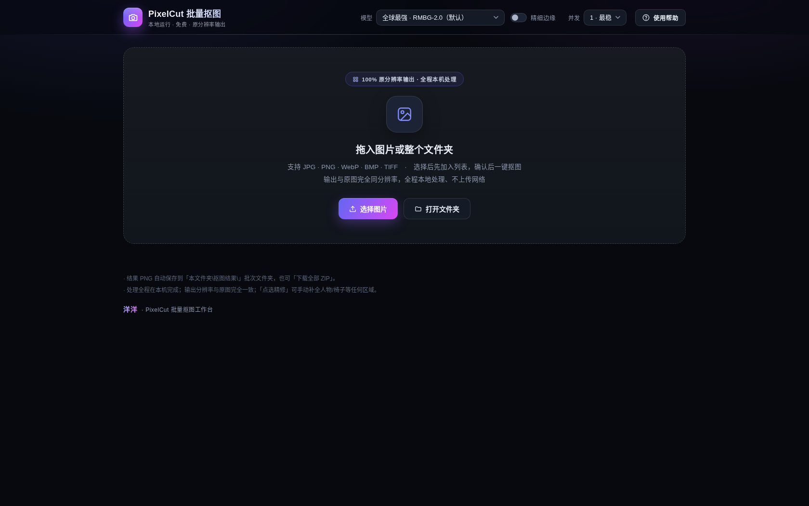
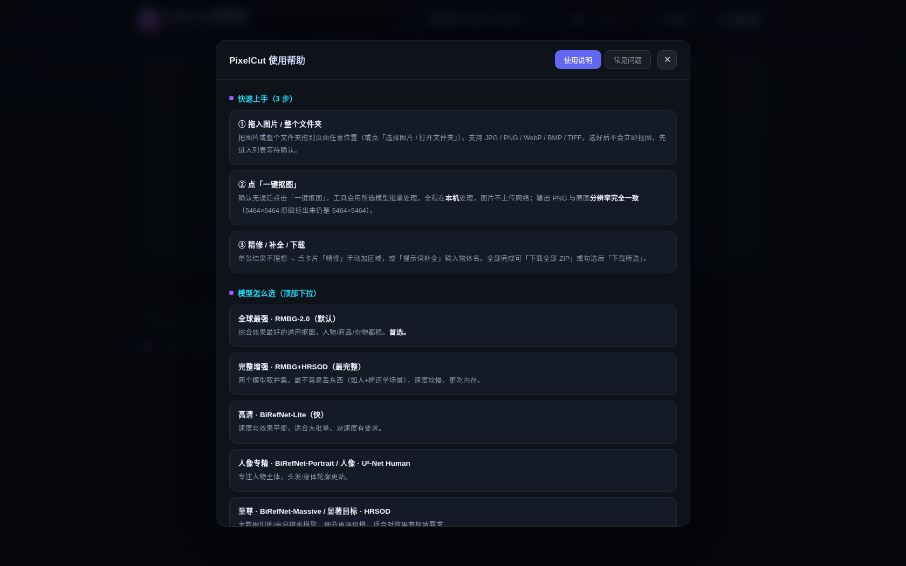

<div align="center">

# 🖼️ 洋洋 · PixelCut 批量抠图工作台

**本地运行 · 完全免费 · 输出与原图同分辨率** 的批量 AI 抠图工具

拖入整个文件夹 → 一键批量抠图 → 透明背景 PNG 原分辨率输出
图片全程在本机处理，**不上传任何服务器**

[](LICENSE)
[]()
[]()
[]()
[]()
[](https://huggingface.co/jkyy/yang-pixelcut-models)

</div>

---

## ✨ 特性速览

| | |
|---|---|
| 🖱️ **批量处理** | 拖入图片或**整个文件夹**，确认后一键抠图；支持 JPG / PNG / WebP / BMP / TIFF |
| 🎯 **原分辨率输出** | 原图 5464×5464，抠出来仍是 5464×5464，**绝不缩水** |
| 🔒 **全程本地** | 模型与处理都在本机完成，图片不上传网络，无数量限制 |
| 🧠 **多模型可选** | RMBG-2.0 / BiRefNet 四档 / U²-Net / ViTMatte 精细边缘 / SAM 精修 / CLIPSeg 提示词 |
| 🎨 **点选精修** | 结果不理想？在图上点几下补全人物、椅子等任何区域（SAM 双档） |
| ✏️ **提示词补全** | 输入「椅子 / chair / 帽子…」自动补全物体，中英文均可，支持批量 |
| ⚡ **并发加速** | 1 / 2 / 3 档并发，多核更快 |
| 💾 **结果管理** | 自动分批次保存，支持下载全部 ZIP / 下载所选 / 打开结果夹 |



---

## 🚀 快速上手（3 步）

```text
① 拖入图片 / 整个文件夹   →   图片先进入列表，不会立即处理
② 确认无误，点「一键抠图」 →   批量处理，全程本机运行
③ 精修 / 下载              →   不满意的点选精修，最后下载全部 ZIP
```

---

## 📦 安装与运行

### 方式 A：绿色版（拷贝即用，推荐）

完整绿色版包含 `models`（约 6GB）与 `runtime`（约 500MB），受 GitHub 单文件 100MB 限制**不存放在本仓库**。如果你已有绿色版目录，将两个文件夹拷贝到本项目根目录，双击 `启动抠图工具.bat` 即可使用。

### 方式 B：从源码运行（模型自动下载）

```bash
pip install -r requirements.txt
python server.py
```

浏览器自动打开 `http://127.0.0.1:8532/`，首次选择模型时自动联网下载。

### 方式 C：Hugging Face 下载模型（推荐）

模型已完整托管，**16 个模型文件、6.4GB、目录结构与原版完全一致**：

> 🌐 **模型地址**：[https://huggingface.co/jkyy/yang-pixelcut-models](https://huggingface.co/jkyy/yang-pixelcut-models)

```bash
pip install huggingface_hub
huggingface-cli download jkyy/yang-pixelcut-models --local-dir models
```

---

## 🧠 模型库

| 界面选项 | 模型 | 特点 |
|---|---|---|
| **全球最强 · RMBG-2.0**（默认） | `bria-rmbg` | 综合效果最好，人物/商品/杂物都稳，首选 |
| **完整增强 · RMBG+HRSOD** | `bria-rmbg + birefnet-hrsod` | 双模型取并集，最不易丢物体（人+椅连坐场景） |
| **高清 · BiRefNet-Lite** | `birefnet-general-lite` | 速度与效果平衡，适合大批量 |
| **人像专精 · BiRefNet-Portrait** | `birefnet-portrait` | 专注人物，头发/身体轮廓更贴 |
| **至尊 · BiRefNet-Massive** | `birefnet-massive` | 大数据训练，细节更强但慢 |
| **显著目标 · HRSOD** | `birefnet-hrsod` | 高分辨率，细节丰富 |
| **通用 · 更快** | `u2net` | 快速模型，低内存 |
| **人像 · U²-Net Human** | `u2net_human_seg` | 快速人像 |
| **精细边缘** | `vitmatte` | 发丝级 matting，修边缘白边/噪点 |
| **点选精修** | `sam`（ViT-B / ViT-L） | 交互式分割，点选补全区域 |
| **提示词补全** | `clipseg` | 按文字提示补全物体 |

> 📦 全部模型下载：[jkyy/yang-pixelcut-models · Hugging Face](https://huggingface.co/jkyy/yang-pixelcut-models)

---

## 📁 目录结构

```
yang-pixelcut/
├── 启动抠图工具.bat   ← 绿色版一键启动
├── server.py           本地服务端（Flask）
├── requirements.txt    依赖清单
├── web/
│   └── index.html      操作页面（单文件）
├── models/             模型目录（自动下载 / 绿色版内置）
├── runtime/            便携 Python 运行环境（绿色版内置）
├── 抠图结果/           输出目录（按时间批次）
├── 使用说明.txt        完整图文使用说明
└── LICENSE             PolyForm Noncommercial 1.0.0
```

---

## ❓ 常见问题

**Q：为什么绿色版那么大（6GB+）？**
A：内置了 11 个开源抠图模型（RMBG-2.0 / BiRefNet 系列 / SAM / U²-Net / ViTMatte / CLIPSeg），全部本地运行。不需要的模型可以在 `models/models/` 下删除，不影响启动。

**Q：模型从哪里下载？**
A：绿色版内置；源码方式运行则首次使用自动下载；也可以从 [Hugging Face](https://huggingface.co/jkyy/yang-pixelcut-models) 手动下载整个模型包。

**Q：打开就闪退怎么办？**
A：绿色版请确认 `models` 与 `runtime` 两个文件夹已放在项目根目录；源码方式请先 `pip install -r requirements.txt`。

**Q：输出分辨率会缩水吗？**
A：不会。输出 PNG 与原图完全同分辨率，原图 5464×5464 抠出来仍是 5464×5464。

**Q：需要联网/登录/付费吗？**
A：都不需要。全程本机处理，永久免费。

---

## 📖 使用帮助



---

## ⚖️ 许可

本项目代码与界面采用 **PolyForm Noncommercial License 1.0.0**（可查看、可学习、可非商业使用，禁止商用）。

```text
Required Notice: Copyright (c) 2026 洋洋
```

各模型版权归其各自作者所有（详见 [Hugging Face 模型卡片](https://huggingface.co/jkyy/yang-pixelcut-models)）。

> 个人学习/自用工具，请勿用于商业用途。有问题欢迎 [提交 Issue](https://github.com/yyds8170-ctrl/yang-pixelcut/issues)。
